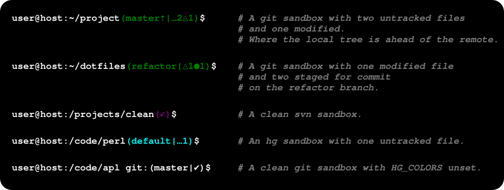

Bash Prompt Version Control State
=================================
[//]: # (Home: https://github.com/meadowface/bash-prompt-vcs)

Show the state of [git](https://git-scm.com/), [Mercurial (hg)](https://www.mercurial-scm.org/)
and [Subversion (svn)](https://subversion.apache.org/) working trees as ambient information in
the bash prompt.


[source](screenshot.svg)

Installation
------------
1. Place [bash-prompt-vcs.bash](bash-prompt-vcs.bash) somewhere, and in your `.bashrc` add:

   ```bash
   if [ -f /path/to/bash-prompt-vcs.bash ]; then
       . /path/to/bash-prompt-vcs.bash
   fi
   ```

   This will define the function `bpvcs_bash_prompt()` and some default
   configuration environment variables.

2. When you define the interactive bash prompt `PS1`, include
   `\$(bpvcs_bash_prompt)` where you want the version control state to
   display.  For example:

   ```
   PS1="\u@\h:\w\$(bpvcs_bash_prompt)\$ "
   ```
   Note that **the backslash before `$(bpvcs…` is necessary.**


Configuration
-------------
You can set these environment variables to control the display of the prompt.
They can be set in `.bashrc` any time after bash-prompt-vcs.bash is included.

Environment Variable        | Default | Description
----------------------------|:-------:|------------
`BPVCS_VERSION`             | 1.1.0   | Version of the software.
`BPVCS_UNTRACKED_INDICATOR` | … <br/>(U+2026) | Indicates items not in version control.
`BPVCS_CHANGED_INDICATOR`   | △ <br/>(U+25B3) | Indicates items that need to be committed.
`BPVCS_STAGED_INDICATOR`    | ● <br/>(U+25CF) | Indicates items that are already staged for commit.
`BPVCS_CLEAN_INDICATOR`     | ✔ <br/>(U+2714) | Indicates that current directory has none of the above.
`BPVCS_AHEAD_INDICATOR`     | ⇡ <br>(U+21E1)  | Indicates that the local tree is ahead of the remote (need to push)
`BPVCS_BEHIND_INDICATOR`    | ⇣ <br>(U+21E3)  | Indicates that the local tree is behind the remote (need to pull)
`BPVCS_GIT_COLOR`           | `\033[0;32m` <br/>(green/lime)  | Sequence used to color git working trees.
`BPVCS_HG_COLOR`            | `\033[0;36m` <br/>(cyan)   | Sequence used to color hg working trees.
`BPVCS_SVN_COLOR`           | `\033[0;35m` <br/>(magenta) | Sequence used to color svn sandboxes.
`BPVCS_ERR_COLOR`           | `\033[0;31m` <br/>(red)    | Sequence used to color errors.
`BPVCS_RESET_COLOR`         | `\033[0m`                  | Sequence used to set normal color.
`BPVCS_COLORS`              |  1         | Unset to turn off color in the prompt. (Doesn't matter what value it has, prompt will have colors as long as it's set.)

The indicators can be more than one character if desired.

The color sequences are terminal-dependent.  The default
[ANSI-escapes](https://en.wikipedia.org/wiki/ANSI_escape_code#Colors) should work in
most terminals.  If you have trouble, see if your `$TERM` variable is set to
something unusual.  See also: [Terminal codes introduction](http://wiki.bash-
hackers.org/scripting/terminalcodes#foreground_coloring).

There can be no visible characters in the `*_COLOR` variables as they are
wrapped in sentinels that tell bash they are invisible.  Putting visible
characters in them will cause rendering issues within readline.


Problem & Principles
--------------------
> I compulsively run `git status` to look at the dirty state of the directory,
> even if I'm not in a git working tree.
> I want to make that information ambient and if possible, encourage clean-sandbox
> habits.

There are many ways to solve the above problem which don't involve writing my
own prompt, like the many projects linked [below](#user-content-similar-projects--inspirations).
Some of them are quite close to what I want.  Most of them solve the above problem.  However,
this is a chance  to make it Just Right(tm) and learn a few things in the process.
Below are the (arbitrary) principles applied.

* **Don't distract.**  I want ambient information, not a bedazzled cornucopia of noise.
  * Don't use up too much screen space.
  * Use subtle colors, not many.
  * Minimize noise and complexity.  I don't want to need a Rosetta stone to interpret the prompt.
  * Don't add anything to the prompt if not in a working tree.
* **Easy-to-audit.**  This is going into the shell environment I live in, I'd like to understand it.
  * Short but not minimal.  Don't do so much it's long to read but don't make it so terse as to be cryptic.
  * Limit side-effects & pollution.  Don't spew too many functions and variables into the shell environment.
* **Use bash.**
  * Don't spin up another interpreter, [no matter how tempting](http://www.python.org).
  * Code in the bash dialect as opposed to generic [Posix shell](http://pubs.opengroup.org/onlinepubs/9699919799/utilities/V3_chap02.html#tag_18).  It's a bash-prompt not a shell-prompt.
* **No network.**  The local prompt should not require net access.
* Respect abstraction barriers.
  * Run `git status` instead of looking in `.git`.
* Spawn as few processes as possible.
  Note that this isn't the same thing as speed.  Modern machines can do a *lot* before causing a delay in the prompt display.  This is more of a hygiene thing.
* Try to encourage clean working trees.  The prompt for a clean tree should have a visceral good feel to it if possible.
* Get better at `bash`.  Getting this to work doesn't take too long, but take
  some time to look at bash style guides and best practices and try to follow.


Similar Projects & Inspirations
-------------------------------
* https://gist.github.com/henrik/31631 - Short and simple, git-only.  Suggested `--porcelain` in the comments.
* [bash-git-prompt](https://github.com/magicmonty/bash-git-prompt/) - Modeled the output after this one as I liked its terseness.
* [vcprompt](https://github.com/djl/vcprompt) - Unmaintained, but the first I came across that made me think to include hg and svn.
* [coderwall article](https://coderwall.com/p/pn8f0g/show-your-git-status-and-branch-in-color-at-the-command-prompt) - I liked the simplicity and progression of this article.
* [gitprompt.sh](https://github.com/jcgoble3/gitstuff/blob/master/gitprompt.sh) - Simple.  Clean.  Has the number-indicator output pattern.
* [Promptastic](http://painl.es/promptastic/) - I really like the look of this one in the screenshot, but would hate to have that much information in my prompt.
* [sexy-bash-prompt](https://github.com/twolfson/sexy-bash-prompt) - Has tests!  I like the delta-icon.  A bit too much color.
* [pure](https://github.com/sindresorhus/pure) - zsh not bash, but I like the indicators and use them for git upstream status.
* [bash_vcs](https://github.com/mfouesneau/bash_vcs) - Nice clean code.
* [other projects on github](https://github.com/search?utf8=%E2%9C%93&q=bash+vcs+prompt&type=Repositories&ref=searchresults) - with similar names.


References
----------
* [Awesome Bash](https://github.com/awesome-lists/awesome-bash) - Possibly the best landing page for bash that I've found.
* [BashGuide](http://mywiki.wooledge.org/BashGuide) - Great reference.
* [how do I list the functions defined in my shell?](http://stackoverflow.com/questions/4471364/how-do-i-list-the-functions-defined-in-my-shell) - An answer here suggested the clever use of `compgen` to show defined shell symbols, which is used in the tests.
* [Google's style guide](https://google.github.io/styleguide/shell.xml) and this [Shell Scripting - Best Practices](http://fahdshariff.blogspot.com/2013/10/shell-scripting-best-practices.html) post were both useful in refining the code.
* [Escape non-printing characters in a function for a Bash prompt](http://superuser.com/questions/301353/escape-non-printing-characters-in-a-function-for-a-bash-prompt) - Explains both `\[` and `\]` and translating them to `\x01` and `\x02`.
* [Obsolete and deprecated syntax](http://wiki.bash-hackers.org/scripting/obsolete) - One of the few places that explains the pitfalls of `set -e` instead of just claiming it's good style.

License
-------
Distributed under the terms of the MIT License, see [LICENSE](LICENSE) file for details.

Future Thoughts
---------------
These are thoughts for later.  They may or may not be implemented.

* Maybe hide or abbreviate default branch names like master in git and default in hg to reduce noise in common cases.
* Put different vcs functions into separate files that can be conditionally sourced?
* Don't export configuration variables with default values, just have default values?
* Use `\E` instead of `\033`?
* Use printf instead of echo?
* Somehow indicate (change pipe?) pure local working-trees?
